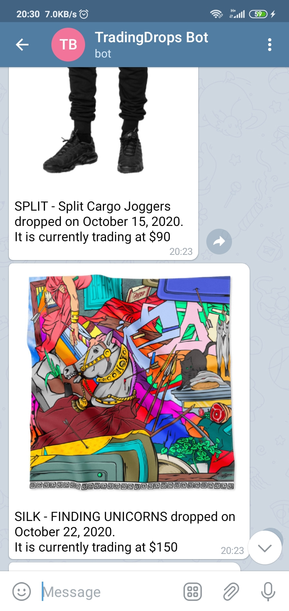

# Trading Drops Telegram Bot
It's a telegram bot that alerts users of product and artwork releases (drops) on [Zora](https://ourzora.com/) and [Foundation](https://foundation.app/).


## How to Use
https://t.me/tradedrops_bot

### Commands
- `/start`
- `/subscribe <service>`
    - eg, `/subscribe zora` will subscribe you to updates from Zora


## Development
### Installation
```
npm i
```

- Make sure you create a .env file. Use the .env.sample file as reference.
- To run, type `npm start` into your terminal

### Tests
Mocha and chai are used in the testing suites.
